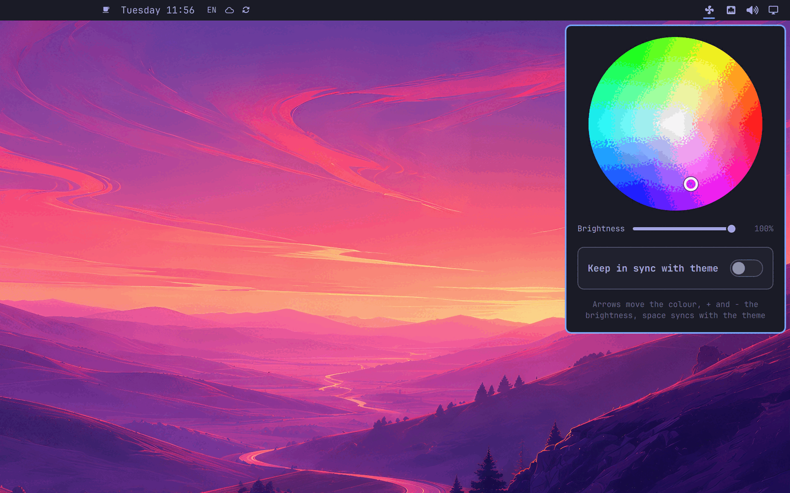

# Framework Desktop RGB

A colour wheel in the Omarchy bar for the eight LEDs on the Framework Desktop fan. Pick a colour, set the brightness, or tick one box and let the LEDs follow the accent colour of your Omarchy theme.



## What it does

- **Colour wheel.** The angle picks the hue, the distance from the centre the saturation.
- **Brightness.** A slider below the wheel; all the way down turns the LEDs off.
- **Keep in sync with theme.** Takes hue and saturation from the theme accent and follows every theme switch. Your brightness stays. Touching the wheel turns the sync off again.
- **Keyboard.** Arrow keys move the colour (Shift for bigger steps), `+` and `-` change the brightness, space toggles the sync, Escape closes the panel.

The colour is saved in the widget's entry in `~/.config/omarchy/shell.json` and sent to the LEDs again when the shell starts, since the embedded controller forgets it on a cold boot.

Only the Framework Desktop has these LEDs. On any other machine the panel says so and does nothing.

## Requirements

- A Framework Desktop
- `framework_tool` from the `framework-system` package: `omarchy pkg add framework-system`

## Install

```bash
omarchy plugin add https://github.com/jankeesvw/omarchy-framework-desktop-rgb --enable
```

### One-time setup

Setting the LEDs goes through the embedded controller, which only root can talk to. The first time you open the panel it offers to run a setup in a terminal (click the button or press Enter). You can also run it yourself:

```bash
~/.config/omarchy/plugins/jankeesvw.framework-desktop-rgb/bin/framework-desktop-rgb grant
```

It asks for your sudo password once and installs two things:

- `/usr/local/libexec/framework-desktop-rgb-apply`, a root-owned copy of [`libexec/framework-desktop-rgb-apply`](libexec/framework-desktop-rgb-apply). It accepts exactly one argument, a colour as six hex digits, and runs `/usr/bin/framework_tool --rgbkbd 0` with that colour for all eight LEDs. Nothing else.
- `/etc/sudoers.d/framework-desktop-rgb`, validated with `visudo` before it is installed, which lets your user run that one helper without a password, and only with an argument matching `^[0-9A-Fa-f]{6}$`.

This is deliberately narrower than opening `/dev/cros_ec` to your user, which would also hand over fan control, charge limits and firmware flashing.

## Privacy and network

The plugin makes no network requests. It reads `/sys/class/dmi/id/sys_vendor` and `product_name` to recognise a Framework Desktop, and writes nothing but its own settings entry in `shell.json`.

## Removing

Remove the root helper and the sudoers rule first, because they live outside the plugin directory and survive a plugin removal:

```bash
~/.config/omarchy/plugins/jankeesvw.framework-desktop-rgb/bin/framework-desktop-rgb revoke
omarchy plugin remove jankeesvw.framework-desktop-rgb
```

`revoke` deletes exactly `/usr/local/libexec/framework-desktop-rgb-apply` and `/etc/sudoers.d/framework-desktop-rgb`. The LEDs keep their last colour until the next cold boot.

## Licence

MIT
